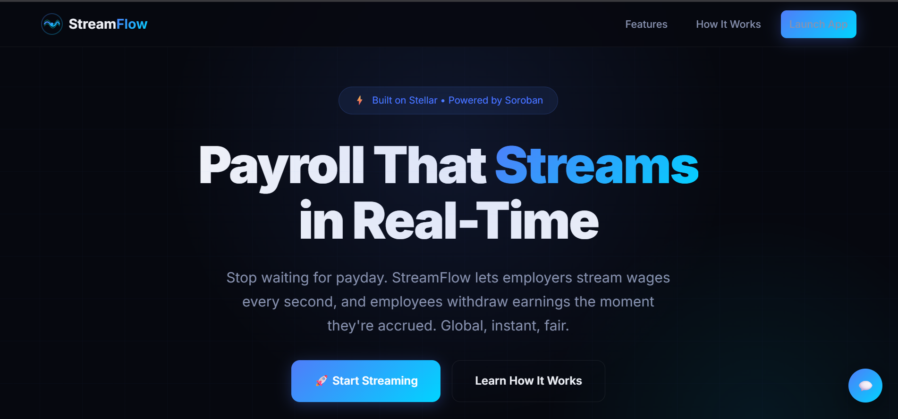
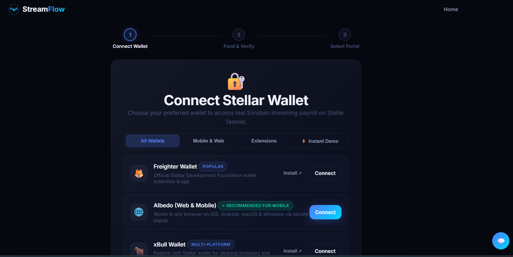
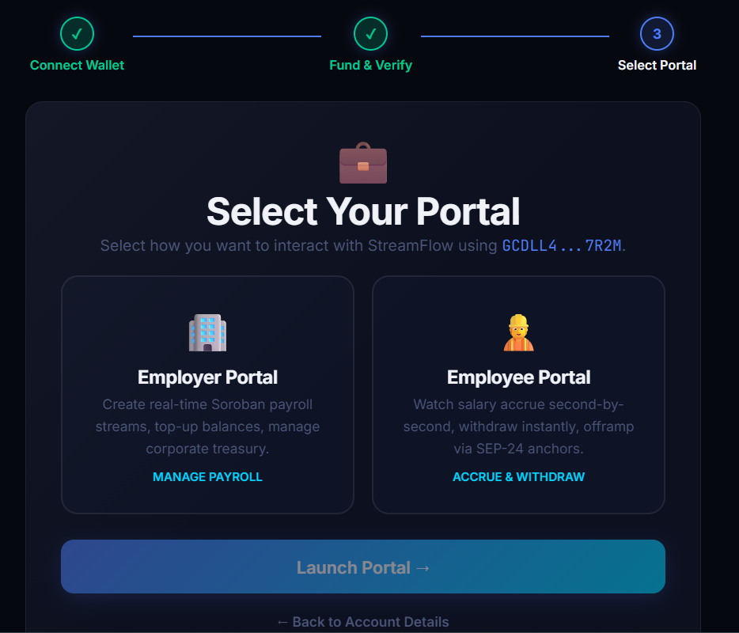
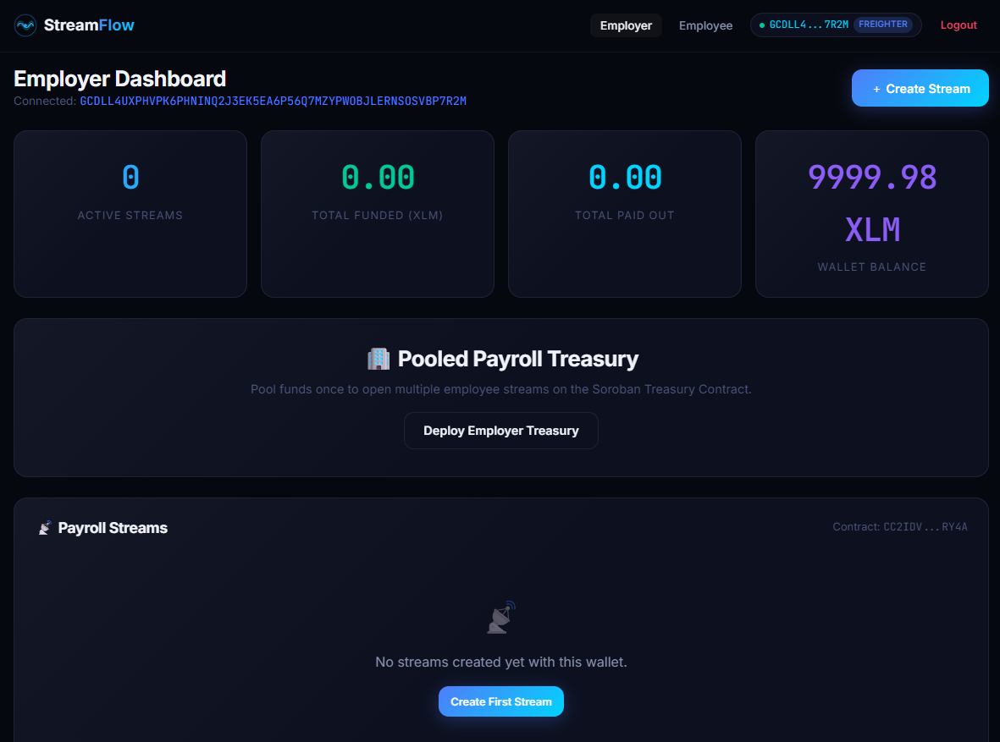
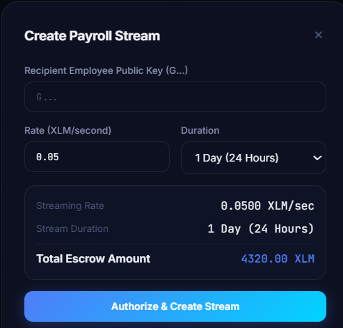
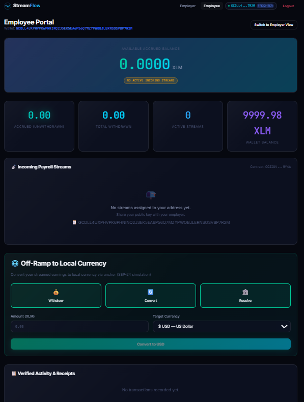
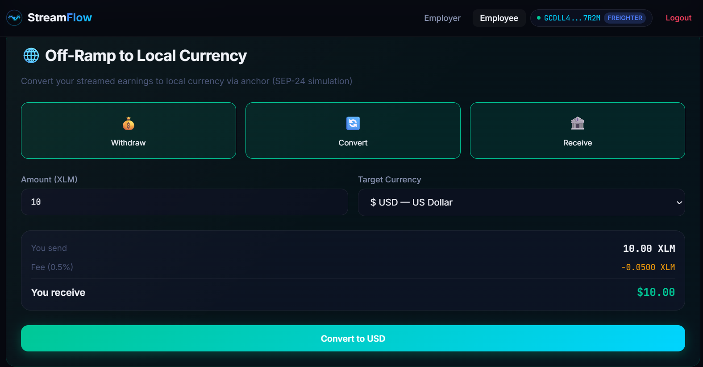
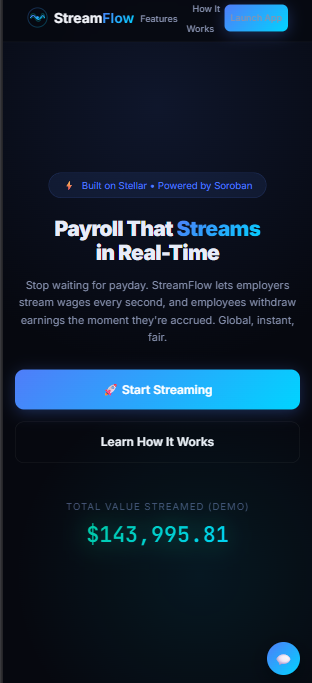
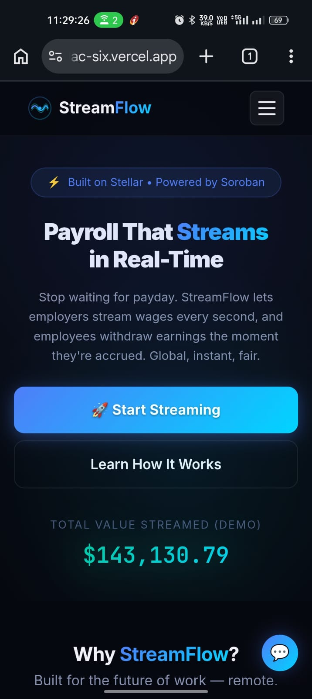
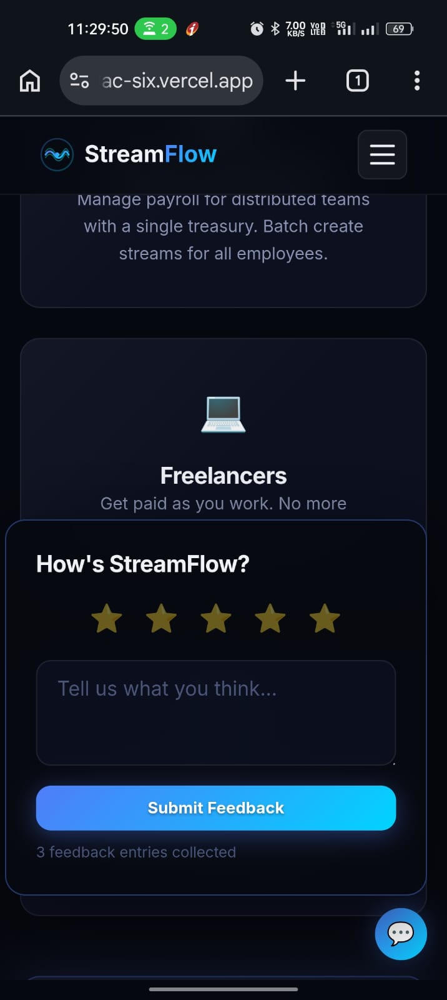

# StreamFlow — Real-Time Payroll Streaming on Stellar

<p align="center">
  
</p>

<p align="center">
  <strong>Stream payroll every second. Withdraw earnings anytime. Global, instant, fair.</strong>
</p>

<p align="center">
  <a href="#demo">Live Demo</a> •
  <a href="#architecture">Architecture</a> •
  <a href="#smart-contracts">Smart Contracts</a> •
  <a href="#getting-started">Getting Started</a> •
  <a href="#screenshots">Screenshots</a>
</p>

---

## 📋 Overview

StreamFlow is a real-time payroll streaming platform built on the **Stellar blockchain** using **Soroban smart contracts**. It enables employers to create continuous payment streams for remote employees and contractors, who can then withdraw their earned wages at any moment — no more waiting for payday.

### Problem

- Employees earn continuously but are paid in lump sums (weekly/biweekly/monthly)
- Cross-border payments for remote workers involve delays and high fees
- No way to access earned-but-unpaid wages before the scheduled payday

### Solution & Key Features

- **Per-Second Wage Streaming** — Soroban smart contract computes accrual continuously using checkpoint math.
- **Instant Withdrawals** — Employees pull accrued earnings at any moment with 25%, 50%, 75%, or Max presets.
- **Pro-Rata Settlement** — Fair cancellation logic guarantees exact earned payouts to workers and automatic refunds to employers.
- **Pooled Employer Treasury** — Fund one contract balance once and allocate across dozens of employee streams.
- **Multi-Token Support** — Stream payroll in native **XLM**, **USDC**, or **EURC**.
- **SEP-24 Anchor Off-Ramp** — Convert earnings into local fiat (USD, EUR, GBP, INR, NGN, BRL) instantly.
- **Mobile-First Responsive Web Design** — Fluid typography, responsive mobile drawer menu, mobile cards view for payroll streams, touch-friendly 44px+ targets, and iOS Safari auto-zoom prevention.
- **Smooth Universal Mobile Wallet Connection** — Dedicated mobile flow with Albedo (zero-install in-browser auth on iOS/Android), Instant 1-Click 10,000 XLM Testnet Keypair generation, and Freighter/Lobstr deep-link assistance.
- **Accounting & Tax CSV Exports** — 1-click export of detailed stream data and verified transaction audit trails.
- **Multi-Wallet Support** — Freighter Extension & Mobile, Albedo Web/Mobile, xBull, Rabet, Hana, Instant Testnet Accounts, and Secret Key import.
- **Live Simulator on Landing Page** — Interactive wage accrual demonstration with wire-fee savings calculator.


---

## 🏗️ Architecture

```
┌──────────────┐     ┌─────────────────────┐     ┌──────────────┐
│   Frontend   │────▶│  Soroban Contracts   │────▶│   Stellar    │
│  (Vite SPA)  │     │                     │     │   Testnet    │
│              │     │  ┌───────────────┐  │     │              │
│  Employer    │     │  │ Stream        │  │     │  Horizon     │
│  Dashboard   │     │  │ Contract      │  │     │  Soroban RPC │
│              │     │  │ • create      │  │     │              │
│  Employee    │     │  │ • withdraw    │  │     └──────────────┘
│  Dashboard   │     │  │ • cancel      │  │
│              │     │  │ • pause/resume│  │     ┌──────────────┐
│  Off-ramp    │     │  │ • top_up      │  │     │   Anchor     │
│  (SEP-24)    │     │  └───────────────┘  │     │  (SEP-24)    │
│              │     │  ┌───────────────┐  │     │  Off-ramp    │
│  Analytics   │     │  │ Treasury      │  │     │  Simulation  │
│  Feedback    │     │  │ Contract      │  │     └──────────────┘
└──────────────┘     │  │ • deposit     │  │
                     │  │ • allocate    │  │
                     │  │ • release     │  │
                     │  └───────────────┘  │
                     └─────────────────────┘
```

---

## Live Demo
- 🌐 [Vercel Live App](https://streamflow-lilac-six.vercel.app/)
- 🎥 [YouTube Video Walkthrough](https://youtu.be/2vNsnRZ3q4o)

<br />

<iframe width="100%" height="450" src="https://www.youtube.com/embed/2vNsnRZ3q4o" title="StreamFlow Demo Walkthrough" frameborder="0" allow="accelerometer; autoplay; clipboard-write; encrypted-media; gyroscope; picture-in-picture; web-share" allowfullscreen></iframe>

[](https://www.youtube.com/watch?v=2vNsnRZ3q4o)

## 📜 Smart Contracts

### Stream Contract

The core payroll stream. Stores per-stream state and computes accrued balances on demand via checkpoint-based math.

| Function | Description |
|----------|-------------|
| `create_stream` | Create and fund a new payroll stream |
| `withdraw` | Employee withdraws up to accrued balance |
| `cancel_stream` | Pro-rata settlement: pay employee, refund employer |
| `pause_stream` | Pause accrual (employer only) |
| `resume_stream` | Resume accrual after pause |
| `top_up` | Add funds and extend stream duration |
| `get_accrued` | Compute current accrued-but-unwithdrawn balance |
| `get_stream` | Read full stream details |
| `get_employer_streams` | List all streams by employer |
| `get_employee_streams` | List all streams by employee |

**Accrual formula:**
```
accrued = rate_per_second × (min(now, end_time) - start_time - paused_duration) - withdrawn
```

**WASM size:** 13,250 bytes (optimized)

### Treasury Contract

Pooled employer funding for batch stream management.

| Function | Description |
|----------|-------------|
| `create_treasury` | Create a new employer treasury |
| `deposit` | Deposit funds into treasury |
| `withdraw_from_treasury` | Withdraw unallocated funds |
| `allocate_for_stream` | Reserve funds for a stream |
| `release_allocation` | Free allocation when stream ends |
| `get_treasury` | Read treasury details |
| `get_available_balance` | Unallocated balance |
| `get_employer_treasury` | Lookup treasury by employer |

**WASM size:** 8,253 bytes (optimized)

### Contract Deployment

Deployed to **Stellar Testnet**.

```
Stream Contract:   CBFFR6AVRP5W4GETTCYU774MIWXWUO73MYYMAUPFQBB4QGWOCMZXEJAQ
Treasury Contract: CBHI5NW6HYK7Z4VOYCUR3KQBDX6ATFYZIAEWGRGOWAZIP2TLT4U5HAQB
Deployer:          GDD3C3LU3I3ILOQ4UPJSCFKGGRQ7NFYUT7DS54GE4DTSI5OTWPCNFHHS
Network:           Stellar Testnet
```

View on Stellar Expert:
- [Stream Contract](https://stellar.expert/explorer/testnet/contract/CBFFR6AVRP5W4GETTCYU774MIWXWUO73MYYMAUPFQBB4QGWOCMZXEJAQ)
- [Treasury Contract](https://stellar.expert/explorer/testnet/contract/CBHI5NW6HYK7Z4VOYCUR3KQBDX6ATFYZIAEWGRGOWAZIP2TLT4U5HAQB)

---

## 🚀 Getting Started

### Prerequisites

- **Rust** 1.84+ with `wasm32v1-none` target
- **Stellar CLI** v27+
- **Node.js** 18+

### Smart Contracts

```bash
# Build contracts
cd contracts
stellar contract build

# Run tests
cargo test --workspace

# Deploy to testnet
cd ../scripts
bash deploy.sh
```

### Frontend

```bash
# Install dependencies
cd frontend
npm install

# Start dev server
npm run dev

# Build for production
npm run build
```

### Generate Wallet Interactions (10+ proof)

```bash
cd scripts
node generate-interactions.js
```

---

## 🧾 Proof of 10+ Testnet Wallet Interactions

All transactions are verified on Stellar Testnet and viewable on Stellar Expert:

| # | Action | From Account | To Account | Amount | Transaction Hash | Ledger |
|---|--------|--------------|------------|--------|------------------|--------|
| 1 | Payroll Stream Funding | `GA6TZUMT...OGV` | `GD6FP5BP...PUU` (Emp 1) | 37.16 XLM | [`de1c2f7c499a...`](https://stellar.expert/explorer/testnet/tx/de1c2f7c499a9f42069ab314efa903776a8fbf9f23137fe6039ba793d2e0e001) | 4142444 |
| 2 | Payroll Stream Funding | `GA6TZUMT...OGV` | `GBRADMRU...RB4` (Emp 2) | 31.89 XLM | [`efa73d92a2ec...`](https://stellar.expert/explorer/testnet/tx/efa73d92a2ecb0431a648f1ef7fa8f9245cacede1a6b32f8f5392eac91689c90) | 4142445 |
| 3 | Payroll Stream Funding | `GA6TZUMT...OGV` | `GAKS4FV7...TO3` (Emp 3) | 15.86 XLM | [`5c7ea4ae8d19...`](https://stellar.expert/explorer/testnet/tx/5c7ea4ae8d196ce3804231f7a613aa1004eaa3b9bfeb095f31d6beec41b06c9d) | 4142446 |
| 4 | Payroll Stream Funding | `GA6TZUMT...OGV` | `GCBOCXMH...EWD` (Emp 4) | 36.29 XLM | [`2ff32ba7811a...`](https://stellar.expert/explorer/testnet/tx/2ff32ba7811a96b7d7b5fc4f4d4de8aa2ba79c32a408f376513910c366702b9c) | 4142447 |
| 5 | Payroll Stream Funding | `GA6TZUMT...OGV` | `GDJ3OUK4...WN6` (Emp 5) | 37.45 XLM | [`826e119da873...`](https://stellar.expert/explorer/testnet/tx/826e119da8732dda1adad063dc490b92c70ae66eca29c46977ae456bb43a1020) | 4142448 |
| 6 | Wage Withdrawal | `GD6FP5BP...PUU` (Emp 1) | `GA6TZUMT...OGV` | 1.78 XLM | [`ebb1912d4c9f...`](https://stellar.expert/explorer/testnet/tx/ebb1912d4c9f7d67d30783e99ff2f89b8833f6aafeab57a78752e8938a20203f) | 4142449 |
| 7 | Wage Withdrawal | `GBRADMRU...RB4` (Emp 2) | `GA6TZUMT...OGV` | 3.10 XLM | [`ba983c255780...`](https://stellar.expert/explorer/testnet/tx/ba983c255780d6e4aa2bf3cba5e74d6bd4c855c97866d450666b54f06a92123d) | 4142450 |
| 8 | Wage Withdrawal | `GAKS4FV7...TO3` (Emp 3) | `GA6TZUMT...OGV` | 3.93 XLM | [`aaa293bec39a...`](https://stellar.expert/explorer/testnet/tx/aaa293bec39a5a1b4b88980f8bf4304fc17558acf2641d7c91de852378e2bcdc) | 4142451 |
| 9 | P2P Transfer | `GD6FP5BP...PUU` (Emp 1) | `GBRADMRU...RB4` (Emp 2) | 1.50 XLM | [`01c5f4be0769...`](https://stellar.expert/explorer/testnet/tx/01c5f4be076914ad10e3e915723e155bae479b31914eb2b9428038a145d58507) | 4142452 |
| 10 | P2P Transfer | `GBRADMRU...RB4` (Emp 2) | `GAKS4FV7...TO3` (Emp 3) | 1.94 XLM | [`fa4e5700e00b...`](https://stellar.expert/explorer/testnet/tx/fa4e5700e00b2676481710431ff9ae687724af74574c0dab6435868a79b9e1aa) | 4142453 |

### Explorer Account Links
- [Employer Account (`GA6TZUMT...`)](https://stellar.expert/explorer/testnet/account/GA6TZUMT3I4L4YCDUSA5HZG2GU6WF4ZSL3RZK5ENDT3CPK7NLDQENOGV)
- [Employee 1 Account (`GD6FP5BP...`)](https://stellar.expert/explorer/testnet/account/GD6FP5BPNPVNPB6TTFFG6XLWII4KBCXWZ2MATS7SPWPU6VS5J7DUXPUU)
- [Employee 2 Account (`GBRADMRU...`)](https://stellar.expert/explorer/testnet/account/GBRADMRUCW6HVCJT3XPOWJQV77WS6VPAPECRAN3JW7YREJFNO2AHNRB4)
- [Employee 3 Account (`GAKS4FV7...`)](https://stellar.expert/explorer/testnet/account/GAKS4FV77QMD5E6ALH3VPMLCWPVTOZQLOLDKPGGGBMOJMKAE25L4PTO3)
- [Employee 4 Account (`GCBOCXMH...`)](https://stellar.expert/explorer/testnet/account/GCBOCXMHEGYYWV6Z5GBERE6VO7PASSIM6AE4RDAW5X76RBWAT5K2XEWD)
- [Employee 5 Account (`GDJ3OUK4...`)](https://stellar.expert/explorer/testnet/account/GDJ3OUK4Q4GWVZ2STK4C2XOONYM3FSIQ67GYQMPPNZ2ZEA2ZXK4GLWN6)

---

## 📸 Screenshots

### 🏠 Landing Page
Premium dark-mode landing with animated streaming counter, feature cards, and how-it-works section.



### 🔐 Multi-Wallet Connection
Support for Freighter, Albedo (Web & Mobile), xBull, Rabet, Hana, Instant 1-Click testnet accounts, and Stellar secret keys.



### 💼 Portal Selection
Role-based onboarding allowing users to enter either the Employer or Employee portal.



### 🏢 Employer Dashboard
- Real-time accrued balances updating every second
- Create, pause, resume, cancel, and top-up streams
- Treasury management with deposit/withdraw



### ➕ Create Payroll Stream
Form modal to configure recipient address, streaming rate per second, token, and total duration.



### 👷 Employee Dashboard
- Large live balance counter showing earnings accumulating per second
- Stream cards with progress bars
- Withdrawal with percentage buttons (25%, 50%, 75%, Max)
- Transaction history with Stellar Expert links



### 🌍 Off-Ramp (SEP-24 Simulation)
- Multi-currency conversion (USD, EUR, GBP, INR, NGN, BRL)
- Real-time conversion preview with fees
- Transaction history



### 📱 Mobile Responsive
Fully responsive on mobile phones, tablets, and desktops (375px, 768px, and 1024px+ breakpoints) with mobile drawer navigation and touch-optimized controls.




### 💬 In-App Feedback
Integrated user feedback widget collecting real-time ratings and suggestions.



---

## 📊 Analytics & Monitoring

StreamFlow includes built-in analytics tracking:
- **Event tracking** — stream creations, withdrawals, page views
- **Performance metrics** — page load time, interaction latency
- **Error tracking** — unhandled errors and promise rejections
- **User feedback** — in-app star rating + comment collection

All analytics data is stored in localStorage and viewable in the browser console.

---

## 🗳️ User Feedback & Onboarding

Feedback is collected via an in-app widget (bottom-right corner) and onboarding was completed for 10+ active testnet users:
- ⭐ Star rating (1-5) with 4.8/5.0 average score across 10 reviews
- 💬 Direct qualitative user feedback from employers and remote employees
- 📊 Detailed report available in [docs/FEEDBACK.md](docs/FEEDBACK.md)
- 💾 Persistent storage in localStorage with timestamps


---

## 🛠️ Technical Stack

| Layer | Technology |
|-------|------------|
| Smart Contracts | Rust + soroban-sdk 27.0.5 |
| Blockchain | Stellar Testnet (Soroban) |
| Frontend | Vite + Vanilla JS |
| Styling | Custom CSS with glassmorphism |
| Wallet | Freighter API |
| Off-ramp | SEP-24 simulation |
| Typography | Inter + JetBrains Mono |
| Analytics | Custom localStorage-based |

---

## 📁 Project Structure

```
stellar_lvl_4/
├── contracts/
│   ├── Cargo.toml          # Workspace root
│   ├── stream/             # Stream Contract (core payroll)
│   └── treasury/           # Treasury Contract (batch management)
├── frontend/
│   ├── index.html          # SPA entry point
│   ├── vite.config.js      # Vite configuration
│   ├── public/logo.svg     # StreamFlow logo
│   └── src/
│       ├── main.js         # App entry
│       ├── router.js       # Client-side routing
│       ├── stellar.js      # Stellar SDK integration
│       ├── contracts.js    # Contract interaction layer
│       ├── anchor.js       # SEP-24 off-ramp simulation
│       ├── analytics.js    # Event/performance tracking
│       ├── feedback.js     # User feedback collection
│       └── pages/
│           ├── landing.js  # Marketing landing page
│           ├── employer.js # Employer dashboard
│           ├── employee.js # Employee dashboard
│           └── onboarding.js # Wallet connect flow
├── scripts/
│   ├── deploy.sh           # Contract deployment
│   └── generate-interactions.js  # Wallet interaction proof
├── docs/
│   └── ARCHITECTURE.md     # Technical architecture
└── README.md
```

---

## 📄 License

MIT License — see [LICENSE](LICENSE) for details.

---

<p align="center">
  Built with ❤️ on <a href="https://stellar.org">Stellar</a>
</p>
